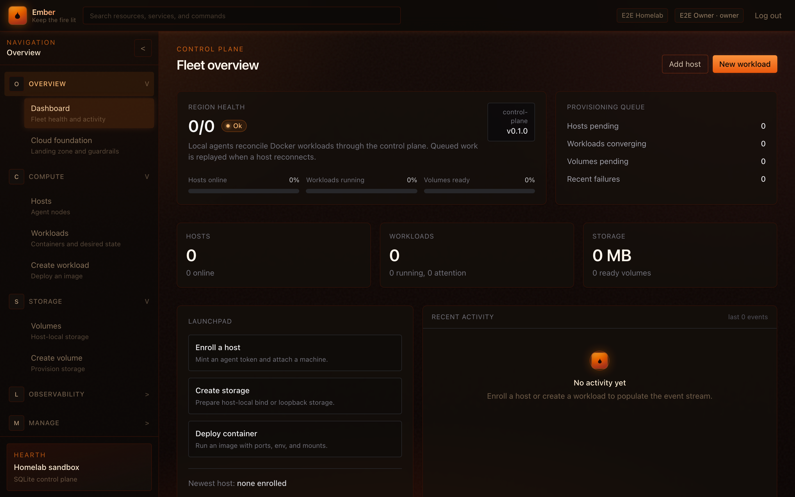
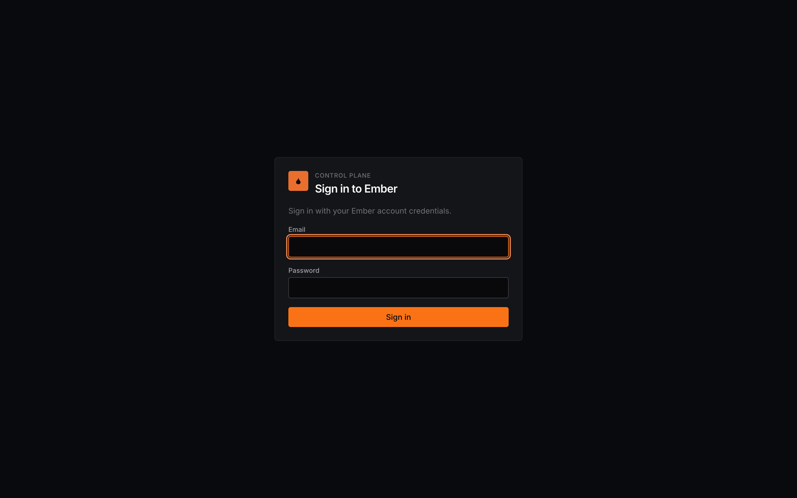
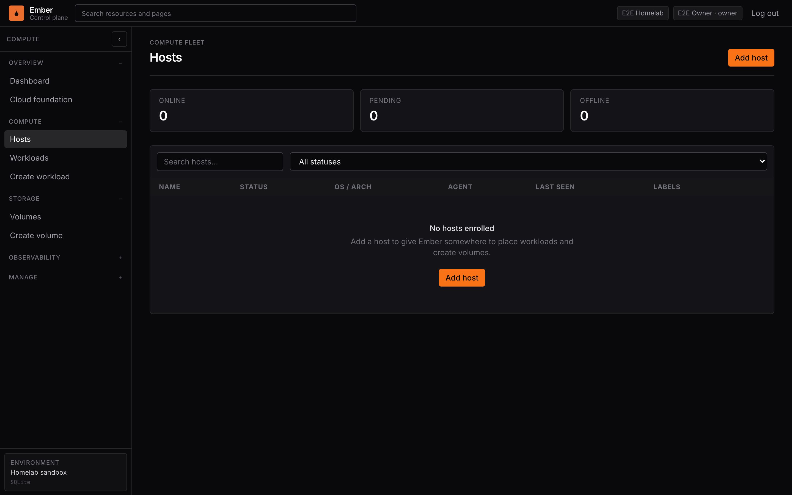
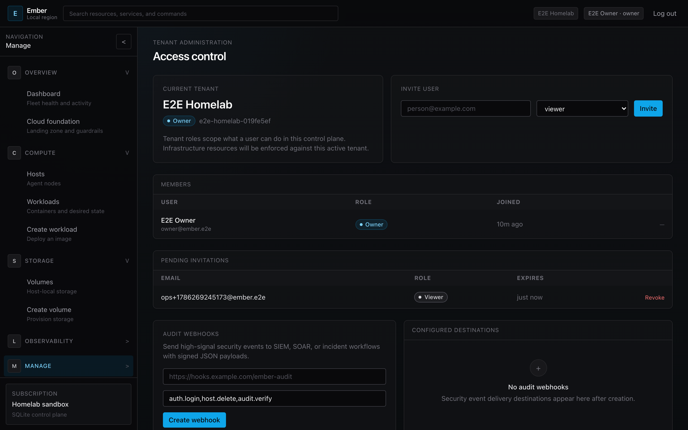
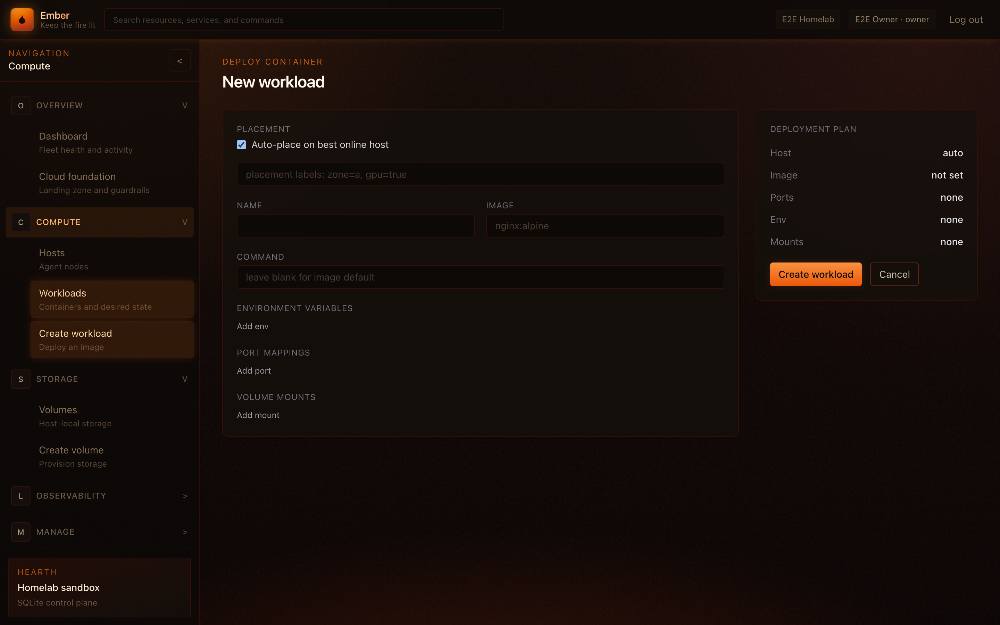
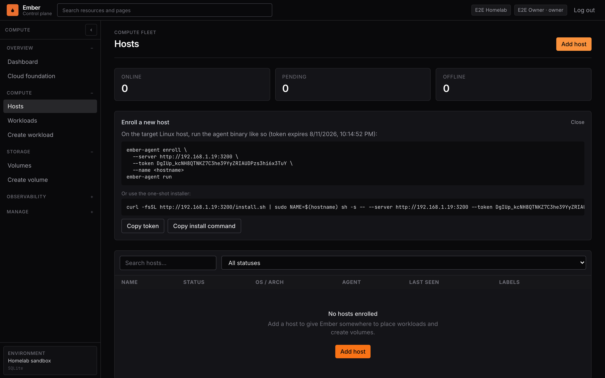
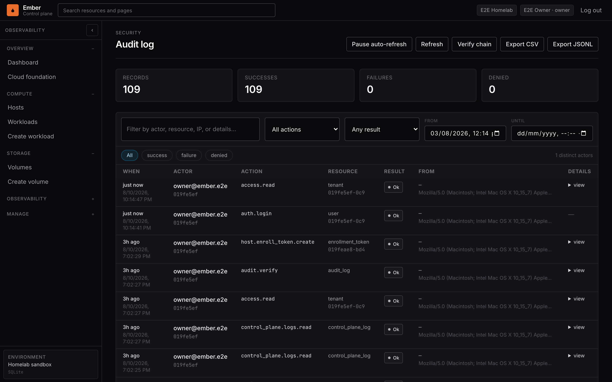

# Ember

Ember is a small self-hosted mini cloud for running Docker workloads on one or more enrolled hosts.

It is intentionally compact: a Rust control plane, a Rust host agent, and a Next.js dashboard. It is useful as a local lab, a lightweight homelab orchestrator, or a foundation for experimenting with control-plane and agent architecture.

### Screenshots

<p align="center">
  
</p>

| Login | Hosts | Access |
| --- | --- | --- |
|  |  |  |

| New workload | Enroll host | Audit log |
| --- | --- | --- |
|  |  |  |

More shots live under [`docs/screenshots/`](docs/screenshots/). Refresh with:

```bash
# Install Chromium once for capture (from e2e/)
(cd e2e && pnpm exec playwright install chromium)

# Against a running stack (LAN, tunnel, or local dev)
BASE_URL=http://192.168.1.19:3200 \
EMBER_EMAIL=owner@ember.e2e EMBER_PASSWORD=ember-e2e-password-1 \
  node scripts/capture-screenshots.mjs
```

## What Ember Does

Ember lets you:

- Create a first owner account and tenant on first run.
- Invite users into the active tenant with roles such as `admin`, `operator`, `viewer`, and `auditor`.
- Enroll a machine as an Ember host.
- See whether enrolled hosts are pending, online, or offline.
- Create host-local volumes.
- Start, stop, and remove Docker containers on a selected host.
- Attach ready volumes to workloads as bind mounts.
- Publish container ports to the host.
- Track recent control-plane, host, workload, and volume events.

The current implementation manages Docker containers directly on each host through the agent. It does not run a Kubernetes cluster, create an overlay network, or migrate workloads between hosts.

## Pieces

- `ember-control-plane`: Rust/Axum API server backed by SQLite. It stores tenants, users, sessions, invitations, hosts, workloads, volumes, tasks, and events.
- `ember-agent`: Rust host agent that enrolls with the control plane, keeps a WebSocket open, and executes Docker and volume commands locally.
- `ember-web`: Next.js dashboard for the Azure-style control plane UI.
- `ember-shared`: Rust protocol crate that exports shared API and wire types to TypeScript with `ts-rs`.

## Repository Layout

```text
.
|-- agent/                 # ember-agent binary
|   `-- src/
|       |-- client.rs      # WebSocket connection, heartbeats, command handling
|       |-- docker.rs      # Docker operations via bollard
|       |-- enroll.rs      # one-shot host enrollment flow
|       |-- executor.rs    # maps protocol commands to local actions
|       |-- state.rs       # local agent state file
|       `-- volumes.rs     # host volume backends
|-- control-plane/         # ember-control-plane binary
|   |-- migrations/        # SQLite schema
|   `-- src/
|       |-- api/           # HTTP API handlers
|       |-- agent_ws.rs    # authenticated agent WebSocket
|       |-- auth.rs        # user sessions, password hashing, session extraction
|       |-- config.rs      # environment-based config
|       |-- db.rs          # SQLite connection and migrations
|       |-- reconciler.rs  # offline detection and task requeue loop
|       |-- scheduler.rs   # task queue and task result propagation
|       `-- state.rs       # shared application state
|-- shared/                # Rust structs shared by control-plane and agent
|   `-- src/protocol.rs    # API payloads and agent wire protocol
|-- web/                   # Next.js dashboard
|-- e2e/                   # Lightpanda + Playwright end-to-end tests
|-- docs/dev-setup.md      # shorter development setup notes
|-- Dockerfile             # multi-stage control-plane image
|-- docker-compose.yml     # control-plane + web production-style stack
`-- scripts/
    |-- dev.sh             # starts control-plane and web together
    `-- e2e.sh             # builds stack deps and runs e2e suite
```

## Architecture

Ember uses a central control plane and long-running host agents.

1. A user opens the web dashboard.
2. If no users exist, the login page shows first-run setup.
3. First-run setup creates:
   - an owner user
   - a tenant
   - an owner membership for that tenant
   - an authenticated browser session
4. Tenant owners/admins can invite other users into the tenant.
5. An authenticated user mints a one-shot host enrollment token.
6. `ember-agent enroll` posts host metadata and the token to `/api/agent/enroll`.
7. The control plane validates and consumes the enrollment token, creates a host row, and returns a persistent agent token.
8. The agent writes its local state and then runs with `ember-agent run`.
9. The running agent connects to `/api/agent/connect` over WebSocket with `Authorization: Bearer <agent-token>`.
10. The control plane sends queued tasks over that socket.
11. The agent executes tasks locally, reports `TaskResult` messages, and sends heartbeat pings with observed container state.
12. The control plane updates SQLite rows and emits events for the dashboard.

### Auth And Tenants

Authentication is owned by the Rust control plane, not the Next.js app. The web app is a client of the Rust API.

The auth model is designed like a compact version of a SaaS auth system:

- `users`: email, display name, Argon2 password hash, disabled state.
- `sessions`: opaque browser session tokens, `HttpOnly`, `SameSite=Lax`, tied to a user and active tenant.
- `tenants`: logical organization/workspace records.
- `tenant_memberships`: maps users to tenants with a tenant role.
- `tenant_invitations`: pending email invitations with hashed invitation tokens and expiry.

The first user becomes `owner` of the first tenant. The UI exposes an **Access control** screen for the current tenant, including members, pending invitations, and the role matrix.

Current tenant roles:

| Role | Intent |
| --- | --- |
| `owner` | Full tenant control, including users, roles, MFA policy in future, infrastructure, and tokens. |
| `admin` | Manage users below owner level and operate all infrastructure. |
| `operator` | Deploy and operate workloads, volumes, and host actions. |
| `viewer` | Read-only access to resources and activity. |
| `auditor` | Read-only access focused on security and activity review. |

Important current state: tenant records, memberships, invites, and session active tenant are implemented. Full per-tenant scoping of hosts, workloads, volumes, tasks, and events is the next enforcement pass.

### Task Model

Most infrastructure actions create a durable task in SQLite:

- Creating a workload enqueues `RunContainer`.
- Stopping a workload enqueues `StopContainer`.
- Deleting a workload enqueues `RemoveContainer`.
- Creating a volume enqueues `CreateVolume`.
- Deleting a volume enqueues `DeleteVolume`.

If the target agent is connected, the task is dispatched immediately over WebSocket. If not, the task remains queued and is replayed when the agent reconnects.

The reconciler runs every 10 seconds. It marks hosts offline after 45 seconds without a heartbeat and moves dispatched tasks back to queued if no result arrives within 60 seconds.

## Data Model

The control plane stores state in SQLite. The main tables are:

- `users`: control-plane user accounts.
- `sessions`: browser sessions tied to users and active tenants.
- `tenants`: tenant/workspace records.
- `tenant_memberships`: tenant role assignments.
- `tenant_invitations`: pending tenant invites with hashed tokens.
- `hosts`: enrolled hosts, their status, agent metadata, and hashed agent tokens.
- `enrollment_tokens`: one-shot host enrollment tokens, stored as SHA-256 hashes.
- `workloads`: desired and observed container state.
- `volumes`: host-local volume records.
- `workload_volumes`: volume attachments for workloads.
- `tasks`: durable commands sent to agents.
- `events`: activity feed rows.

IDs are UUIDv7 strings.

## Prerequisites

- Rust stable, pinned by `rust-toolchain.toml`.
- Node.js 22+.
- `pnpm`.
- Docker on any machine running `ember-agent` (optional for control-plane-only work).

The control plane itself does not need Docker unless you also run an agent on the same machine. For a production-style local stack, use `docker compose up --build`. For development without a host Rust toolchain, you can still run the control plane in a one-off container as shown below.

## Quick Start

From the repository root:

```bash
# Generate TypeScript types from the shared Rust protocol crate.
cargo test -p ember-shared

# Install web dependencies.
(cd web && pnpm install)

# Start the control plane and web app.
bash scripts/dev.sh
```

Open <http://localhost:3000> on the development machine, or use the LAN URL printed by `scripts/dev.sh` from another machine on your network.

On the first run, create the owner account and tenant in the web UI. There is no default admin password.

The dev script binds the Rust control plane to `0.0.0.0:8080`, binds the Next.js app to `0.0.0.0:3000`, and sets `EMBER_PUBLIC_BASE_URL` to `http://<host-lan-ip>:3000`. The generated host enrollment command uses that LAN-facing web URL so another homelab machine can run it directly.

The Next.js app proxies `/api/*` to the control plane at `http://127.0.0.1:8080` from the web server process.

## Production-Style Stack (Compose)

Multi-stage images for the control plane and Next.js dashboard:

```bash
docker compose up --build
```

- Control plane: <http://127.0.0.1:8080/api/health>
- Dashboard: <http://127.0.0.1:3000>

SQLite persists in the `ember-db` volume. Create the first owner account in the UI on first boot. Put TLS and auth-aware routing in front of both services for remote deployments.

### Homelab deploy

If `ssh homelab` works (see `~/.ssh/config`), ship and start on that host:

```bash
bash scripts/deploy-homelab.sh
```

Defaults (busy host-safe ports):

| Service | Host port | URL (LAN example) |
| --- | --- | --- |
| Web | `3200` | `http://192.168.1.19:3200` |
| Control plane | `8080` | `http://192.168.1.19:8080/api/health` |

Override with `EMBER_WEB_PORT`, `EMBER_CP_PORT`, `EMBER_PUBLIC_BASE_URL`, `EMBER_DEPLOY_HOST`, `EMBER_DEPLOY_DIR`.

Remote e2e (API from laptop; browser tests run better **on** the homelab host so Lightpanda can hit `127.0.0.1`):

```bash
# API from laptop
E2E_EXTERNAL_STACK=1 \
E2E_BASE_URL=http://192.168.1.19:3200 \
E2E_CP_URL=http://192.168.1.19:8080 \
  (cd e2e && pnpm exec playwright test --project=api)

# Browser on homelab
ssh homelab 'cd ~/apps/Ember/e2e && \
  E2E_EXTERNAL_STACK=1 E2E_BASE_URL=http://127.0.0.1:3200 E2E_CP_URL=http://127.0.0.1:8080 \
  pnpm exec playwright test --project=lightpanda'
```

## Running The Control Plane In Docker (dev)

If Rust is not installed on the host, run the Rust control plane in Docker with a persisted SQLite volume:

```bash
docker volume create ember-db
docker volume create ember-cargo-registry
docker volume create ember-cargo-git

docker rm -f ember-control-plane 2>/dev/null || true
docker run -d \
  --name ember-control-plane \
  -p 0.0.0.0:8080:8080 \
  -e EMBER_BIND_ADDR=0.0.0.0:8080 \
  -e EMBER_DB_URL='sqlite:///data/ember.db?mode=rwc' \
  -e EMBER_PUBLIC_BASE_URL="http://$(ipconfig getifaddr en0 2>/dev/null || hostname -I | awk '{print $1}'):3000" \
  -e RUST_LOG='info,sqlx=warn,tower_http=info' \
  -v "$PWD":/app \
  -v ember-db:/data \
  -v ember-cargo-registry:/usr/local/cargo/registry \
  -v ember-cargo-git:/usr/local/cargo/git \
  -w /app \
  rust:1.80-slim-bookworm \
  bash -c 'export PATH=/usr/local/cargo/bin:$PATH; cargo run -p ember-control-plane'
```

Then run the web app separately:

```bash
cd web
pnpm install
pnpm dev
```

Useful Docker commands:

```bash
docker logs -f ember-control-plane
docker stop ember-control-plane
docker start ember-control-plane
curl http://127.0.0.1:8080/api/health
```

## Running The Full Local Flow

To run real containers locally, keep the control plane and web app running and open a second terminal.

Build the agent:

```bash
cargo build -p ember-agent
```

In the UI, go to `Hosts -> Add host` and copy the generated install command. From another homelab machine it will look like this:

```bash
curl -fsSL http://<ember-host-ip>:3000/install.sh | sudo NAME=$(hostname) sh -s -- --server http://<ember-host-ip>:3000 --token <TOKEN>
```

The installer is served by the Next.js app from `web/public/install.sh`. It installs `ember-agent` from `EMBER_AGENT_BIN_URL` when provided, or falls back to `cargo install --git https://github.com/jusso-dev/Ember.git ember-agent --locked --force --root /usr/local`.

For local development without the installer, enroll a local development host manually:

```bash
EMBER_AGENT_STATE_DIR=/tmp/ember-agent-dev1 \
EMBER_VOLUMES_DIR=/tmp/ember-volumes-dev1 \
  ./target/debug/ember-agent enroll \
    --server http://127.0.0.1:8080 \
    --token <TOKEN> \
    --name dev-1
```

Start the agent:

```bash
EMBER_AGENT_STATE_DIR=/tmp/ember-agent-dev1 \
EMBER_VOLUMES_DIR=/tmp/ember-volumes-dev1 \
  ./target/debug/ember-agent run
```

The host should become `online` in the dashboard within a few seconds.

### Create A Volume

In the UI:

1. Go to `Volumes -> New volume`.
2. Choose the enrolled host.
3. Use backend `hostdir`.
4. Pick a name such as `data`.
5. Create the volume.

For `hostdir`, the agent creates a directory under `EMBER_VOLUMES_DIR` using the volume ID as the directory name. The requested size is stored in the control plane, but the current `hostdir` backend does not enforce quotas.

### Create A Workload

In the UI:

1. Go to `Workloads -> New workload`.
2. Choose the enrolled host.
3. Use image `nginx:alpine`.
4. Add a port mapping from host port `8081` to container port `80` with protocol `tcp`.
5. Optionally attach the ready volume at `/usr/share/nginx/html`.
6. Create the workload.

The agent pulls the image, creates a Docker container, labels it with `ember.managed=true`, names it `ember-<workload-id-prefix>`, sets restart policy `unless-stopped`, and starts it.

Then browse <http://127.0.0.1:8081>.

## Common Commands

```bash
# Build all Rust crates.
cargo build --workspace

# Run the control plane only.
cargo run -p ember-control-plane

# Run the shared crate tests and regenerate web/lib/types/*.ts.
cargo test -p ember-shared

# Run the Next.js app only.
(cd web && pnpm dev)

# Build the web app.
(cd web && pnpm build)

# End-to-end tests (Lightpanda + Playwright). See Testing below.
bash scripts/e2e.sh

# Production-style stack.
docker compose up --build
```

## Testing

Ember ships an end-to-end suite under `e2e/` that exercises the flows documented in this README.

- **API tests** use Playwright's request client against the control plane and the Next.js `/api/*` rewrite.
- **Browser tests** drive the dashboard through **Lightpanda** over CDP using **Puppeteer** (`puppeteer-core`). Lightpanda is started via `@lightpanda/browser`. (Playwright's `connectOverCDP` path is still brittle against current Lightpanda builds for local navigation; Puppeteer is the stable client for the same CDP server.)

### What the suite covers

| Area | Coverage |
| --- | --- |
| Health | `GET /api/health` on control plane and via web proxy; installer script at `/install.sh` |
| First-run auth | Owner + tenant setup, login, bad password, session cookie, logout, setup-once |
| Authorization | Protected routes return 401 without session |
| Hosts | Mint enrollment token + install command (UI and API) |
| Access control | Tenant members, role matrix, create/revoke invitations |
| Volumes / workloads | Form defaults from the README (`hostdir`, `nginx:alpine`, port fields); create fails cleanly without a host |
| Navigation | Dashboard, launchpad, shell search, observability pages |
| Optional agent flow | Enroll agent, create volume, deploy `nginx:alpine` (Docker required) |

### Run locally

```bash
# Builds control plane, installs deps, starts isolated stack, runs tests.
bash scripts/e2e.sh

# API project only (no browser).
(cd e2e && pnpm test -- --project=api)

# Browser project only (Lightpanda).
(cd e2e && pnpm test -- --project=lightpanda)

# Full README agent path (needs Docker + built ember-agent).
E2E_AGENT_FLOW=1 bash scripts/e2e.sh

# Production web server instead of next dev.
E2E_WEB_MODE=prod bash scripts/e2e.sh
```

The harness starts:

1. Lightpanda CDP on `127.0.0.1:19222` (or Lightpanda Cloud when `LPD_TOKEN` / `CDP_WS_URL` is set).
2. `ember-control-plane` on port `18080` with a temporary SQLite file.
3. Next.js on port `13000` with `CONTROL_PLANE_URL` pointed at that control plane.

Override ports with `E2E_CP_PORT`, `E2E_WEB_PORT`, `E2E_CDP_PORT`. Point at an already-running stack with `E2E_EXTERNAL_STACK=1` and the usual `E2E_BASE_URL` / `E2E_CP_URL` / `CDP_WS_URL` variables.

HTML report: `e2e/playwright-report` after a run (`cd e2e && pnpm report`).

CI runs the same suite via `.github/workflows/ci.yml`.

Security scanning uses free open-source [Trivy](https://github.com/aquasecurity/trivy) in `.github/workflows/trivy.yml`:

- **Filesystem** — HIGH/CRITICAL vulns, secrets, and misconfig across the repo
- **Container images** — builds `Dockerfile` + `web/Dockerfile` and scans them
- **SARIF** — uploaded to GitHub Code Scanning (free on public repos)
- Weekly schedule so new CVEs still surface without a push

Findings fail the job. Suppress only with a short reason in `.trivyignore`.

## Configuration

### Control Plane

| Variable | Default | Description |
| --- | --- | --- |
| `EMBER_BIND_ADDR` | `0.0.0.0:8080` | Address for the Rust API server. |
| `EMBER_DB_URL` | `sqlite://ember.db?mode=rwc` | SQLite database URL. The file is created on first boot. |
| `EMBER_PUBLIC_BASE_URL` | `http://<detected-lan-ip>:3000` | Base URL used when generating installer/invitation-style links. |
| `EMBER_AUDIT_RETENTION_DAYS` | `365` | Days to retain audit rows. |
| `EMBER_CONTROL_PLANE_LOG_RETENTION_DAYS` | `7` | Days to retain control-plane log rows. |
| `EMBER_WORKLOAD_LOG_RETENTION_DAYS` | `7` | Days to retain workload log rows. |
| `EMBER_AGENT_LOG_RETENTION_DAYS` | `7` | Days to retain agent log rows. |
| `EMBER_AUDIT_SINK` | `db` | Comma-separated audit sinks (`db`, webhook delivery metadata). |
| `RUST_LOG` | `info,sqlx=warn,tower_http=info` | Optional tracing filter. |

`EMBER_ADMIN_PASSWORD` is no longer used. Auth is user-backed and starts with first-run account creation.

`GET /api/health` checks process liveness and SQLite connectivity. The control plane shuts down cleanly on `SIGINT` / `SIGTERM`.

### Web

| Variable | Default | Description |
| --- | --- | --- |
| `CONTROL_PLANE_URL` | `http://127.0.0.1:8080` | Destination for the Next.js `/api/*` rewrite. |
| `HOST_IP` | auto-detected by `scripts/dev.sh` | Optional override for the LAN IP printed and used by the dev script. |

### Agent

| Variable | Default | Description |
| --- | --- | --- |
| `EMBER_AGENT_STATE_DIR` | `/var/lib/ember-agent` | Directory containing `state.json`, the persisted host ID, server URL, and agent token. |
| `EMBER_VOLUMES_DIR` | `/var/lib/ember/volumes` | Root directory for agent-created `hostdir` volumes. |
| `RUST_LOG` | `info` | Optional tracing filter. |

## HTTP API Overview

Browser control-plane endpoints require an `ember_session` cookie unless they are setup/login/session endpoints.

| Method | Path | Purpose |
| --- | --- | --- |
| `GET` | `/api/health` | Control-plane health and version. |
| `POST` | `/api/auth/setup` | Create the first owner user and tenant. Only works when no users exist. |
| `POST` | `/api/auth/login` | Create a user session from email/password. |
| `POST` | `/api/auth/logout` | Destroy the current session. |
| `GET` | `/api/auth/session` | Check auth, setup state, user, and active tenant. |
| `GET` | `/api/tenants/current` | Fetch current tenant, members, invitations, and role matrix. |
| `POST` | `/api/tenants/current/invitations` | Create or reissue a tenant invitation. |
| `DELETE` | `/api/tenants/current/invitations/:id` | Revoke a pending invitation. |
| `DELETE` | `/api/tenants/current/members/:id` | Remove a user from the current tenant. |
| `GET` | `/api/hosts` | List hosts. |
| `POST` | `/api/hosts/enroll-token` | Mint a one-shot host enrollment token. |
| `GET` | `/api/hosts/:id` | Fetch one host. |
| `DELETE` | `/api/hosts/:id` | Delete a host if it has no workloads or volumes. |
| `GET` | `/api/workloads` | List workloads. |
| `POST` | `/api/workloads` | Create and start a workload. |
| `GET` | `/api/workloads/:id` | Fetch one workload. |
| `POST` | `/api/workloads/:id/start` | Start or restart a workload. |
| `POST` | `/api/workloads/:id/stop` | Stop a workload. |
| `DELETE` | `/api/workloads/:id` | Remove a workload and its container. |
| `GET` | `/api/volumes` | List volumes. |
| `POST` | `/api/volumes` | Create a volume. |
| `DELETE` | `/api/volumes/:id` | Delete a volume if it is not attached to a workload. |
| `GET` | `/api/events` | List recent events. |
| `POST` | `/api/agent/enroll` | Agent enrollment endpoint. |
| `GET` | `/api/agent/connect` | Agent WebSocket endpoint. |

Request and response types live in `shared/src/protocol.rs` and are exported to TypeScript with `ts-rs`.

## Shared Types

The `ember-shared` crate defines:

- API request/response structs for auth, tenants, hosts, workloads, volumes, and events.
- Agent wire protocol enums: `Command`, `ServerMsg`, and `AgentMsg`.
- Common payload structs for ports, mounts, task results, and heartbeat container summaries.

Running:

```bash
cargo test -p ember-shared
```

exports TypeScript definitions into `web/lib/types/`.

## Current Limitations

- Docker is the only compute backend.
- Workloads are pinned to one host and are not automatically rescheduled elsewhere.
- Tenant accounts, memberships, invites, and active sessions exist, but infrastructure resources are not yet fully tenant-scoped in SQL.
- MFA tables and flows are not implemented yet. The auth model has been structured so TOTP and recovery codes can be added cleanly.
- Invitation acceptance flow is not implemented yet. Owners/admins can create and revoke invitation links.
- The `hostdir` volume backend creates directories but does not enforce size limits.
- `loopback_ext4` is represented in the protocol and UI but is not implemented in the agent.
- Browser updates are polling-based, roughly every 2-3 seconds. There is no browser SSE/WebSocket push yet.
- There is no log streaming.
- There is no TLS termination in this repo. Put a reverse proxy in front for remote deployments.
- The installer script is intentionally minimal. It can install from `EMBER_AGENT_BIN_URL` or fall back to `cargo install --git`; there are no official prebuilt release artifacts yet.

## Development Notes

- The control plane applies SQLite migrations on startup.
- User passwords are hashed with Argon2.
- Browser sessions are opaque tokens stored in SQLite and sent as `HttpOnly`, `SameSite=Lax` cookies named `ember_session`.
- Agent tokens and invitation tokens are stored hashed, not in plaintext.
- Agent-managed containers are selected by Docker label `ember.managed=true`.
- Workload container names are derived from workload IDs: `ember-<uuid-prefix>`.
- The agent removes an existing container with the target Ember name before running a workload, making repeated `RunContainer` commands idempotent at the container-name level.
- Deleting a workload removes the workload row only after the agent reports a successful `RemoveContainer` result.
- Deleting a volume removes the volume row only after the agent reports a successful `DeleteVolume` result.
- Host deletion is blocked while workloads or volumes still reference the host.
